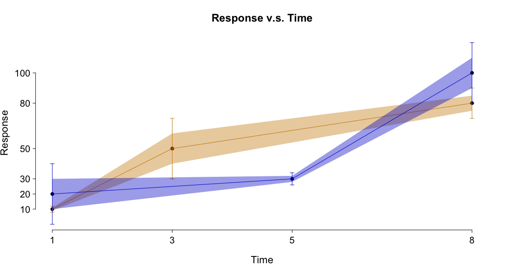

# R Util Tools for Analysis and Visualizations

Current version (0.1.7)

`rutabaga` provides simplest tools for you to easily speed up some calculations 
and manage plots. 

## Installation

```{r}
# install.packages('devtools')
devtools::install_github('dipterix/rutabaga')
```

## Examples

1. Collapse arrays (tensors or matrices)

```{r}
library(rutabaga)
library(microbenchmark)

x <- array(rnorm(1000000), c(10, 10, 100, 100))

microbenchmark(
  'base' = apply(x, c(3, 1), mean),
  'rutabaga' = collapse(x, keep = c(3, 1), average = TRUE), 
  check = function(values){
    dif = sapply(values, function(v){sum(abs(v - values[[1]]))})
    all(dif < 1e-6)
  }
)

# Unit: milliseconds
#      expr       min        lq      mean    median        uq      max neval
#      base 17.648996 18.953004 23.003368 20.112975 26.083851 103.0956   100
#  rutabaga  5.913852  6.060141  7.191069  6.411589  7.638215  15.8295   100

```

2. Base plots

`rutabaga` uses original graphic packages that comes with base R to generate 
prettier plots that are easier to see with larger font sizes, and better 
axis.

```
# Data to plot
x = c(1,3,5,8)
y1 = c(10, 50, NA, 80)
y2 = c(20, NA, 30, 100)
std1 = c(1, 10, NA, 5)
std2 = c(10, NA, 2, 10)


# Create a blank plot with x and y ranges specified 
plot_clean(1:8, 1:120, main = 'Response v.s. Time', xlab = 'Time', ylab = 'Response')


# Add axis for x and y at specific ticks
ruta_axis(side = 1, at = c(1, 3, 5, 8))
ruta_axis(side = 2, at = c(10, 20, 30, 50, 80, 100))


# Plot data
add_points(x, y1)

# Add error bars with 2 x standard deviations
ebars(x, y1, sem = std1 * 2, col = 'orange3')

# Add error polygons with 1 x standard deviations
ebar_polygon(x, y1, std1, col = 'orange3')


# Same procedure for the second sample
add_points(x, y2)
ebars(x, y2, sem = std2 * 2, col = 'blue3')
ebar_polygon(x, y2, std2, col = 'blue3')
```

Preview results:



## How to Participate (Experimental)

You are welcomed to add your own functions to this package. Any merge requests 
will be considered (2 requests per week right now).
You are invited to join slack group at `rutabaga-r-dev.slack.com` if you are 
interested in developing this package.
